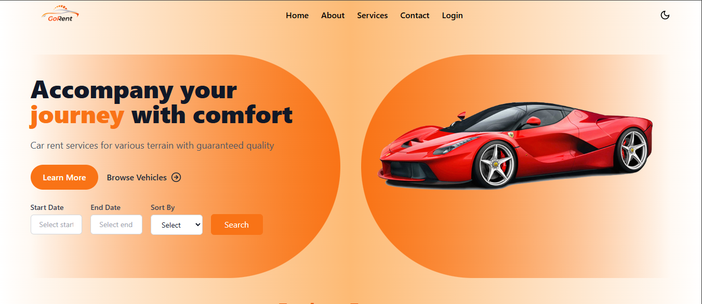

# 🚗 Go Rent — MERN Vehicle Rental Web App

Welcome to **Go Rent**, a modern and responsive vehicle rental web application built using the **MERN stack** (MongoDB, Express.js, React.js, Node.js). Users can search, book, and pay for vehicles, while admins manage listings and bookings efficiently.

---

## 🌍 Live Demo

🔗 **[Visit Back-End](https://vehicle-rental-app-v5vx.onrender.com)** 
🔗 **[Visit Front-End](https://vehiclerentalapk.netlify.app/)** 

📂 Frontend and Backend hosted using Render (Multer-based image upload supported)

---

## ✨ Key Features

### 👤 User Features
- 🚙 Browse vehicles with filters: type, location, price, rating
- 🔍 Search and sort vehicles by date, price, year, and rating
- 📅 Book vehicles by selecting date range
- 💳 Pay securely using Razorpay
- 📥 Download invoice after payment
- 📃 View past bookings & payment history
- ✨ Submit reviews with star ratings
- 📬 Email OTP verification for registration & password update
- 🔐 Update profile, avatar, and password securely
- 🗣 Submit feedback to admins

### 🛠️ Admin Features
- 📦 Add/Edit/Delete vehicles with image upload (Multer)
- 🗂 View all user bookings
- 💬 View submitted user feedback
- 🔐 Admin-only route protection using JWT

---

## 🧰 Tech Stack

| Frontend              | Backend             | Database | Payments  | Others            |
|-----------------------|---------------------|----------|-----------|-------------------|
| React + Vite          | Express.js          | MongoDB  | Razorpay  | Multer (Image Upload) |
| Tailwind CSS          | Node.js             | Mongoose | JWT Auth  | Nodemailer (OTP)  |
| React Router DOM      | bcrypt, dotenv      |          |           |                   |

---

## 📂 Folder Structure
```
vehicle-rental-app/
├── client/ # React frontend
├── server/ # Express backend
├── uploads/ # Vehicle image uploads
├── .env # Environment variables
```
---
## 🖼️ Screenshot




---

## 🚀 Getting Started

## 📦 Installation

###Clone the Repo

```bash
git clone https://github.com/loganathanramsaran/Vehicle_Rental_App.git
cd Vehicle_Rental_App

##Setup Backend
cd server
npm install

Create a .env file inside /server:
PORT=5000
MONGODB_URI=your_mongodb_uri
JWT_SECRET=your_jwt_secret
RAZORPAY_KEY_ID=your_razorpay_key_id
RAZORPAY_KEY_SECRET=your_razorpay_key_secret
BASE_URL=https://vehicle-rental-app-v5vx.onrender.com
CLIENT_URL=https://vehiclerentalapk.netlify.app

Create a .env file inside /client:
VITE_SERVER_URL=https://vehicle-rental-app-v5vx.onrender.com
VITE_RAZORPAY_KEY_ID=your_razorpay_key_id


#Then start the backend:
cd ../client
npm run dev

##Setup Frontend
cd ../client
npm install
npm start
---
